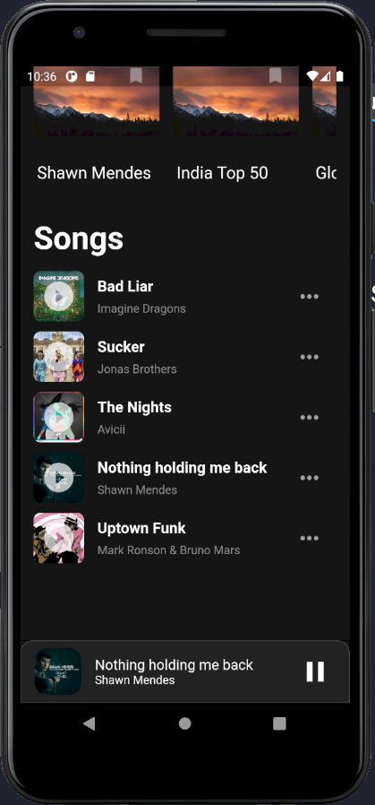

# Music Player
> #### A Music Player App based on Flutter and Firebase.

## Features
* SignUp/Login (firebase authentication)
* Albums and Songs
* Resume/Pause, Backward/Forward Navigation in Songs Queue and Slider on the Song Page
* MiniPlayer for Songs

## Snapshots
### Sign In

### Sign Up

### Albums and Songs

### TrackList

### Track/Song

## Thanks
+ I'd appreciate a star if you find this helpful.

## License

[MIT](http://opensource.org/licenses/MIT)

